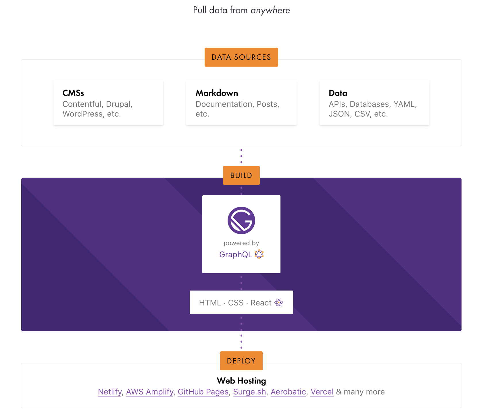

In this article, I'm going to share with you how I created my own Gatsby blog from scratch and publish it to the world!

_This article is part one of the series "Building my Gasbty blog":_

- [Part 2](/post/how-to-structure-a-gatsby-site/)

# Content

1. Why Gatsby?

2. Setup a Gatsby project

3. Write the first page

4. Integrate with Typescript

5. Enforce coding-style with Eslint & Prettier

6. Style components

7. Deploy it

8. Show me the code!

# Why Gatsby?

Gatsby is a modern static site generator (SSG) built on top of React and GraphQL. I already have experience with React, so Gatsby is a fantastic framework to build a static site. It allows me to transfer what I've already known about React to the project without a steep learning curve. Also, I can use React's ecosystem of libraries and tools while I'm able to use the [Gatsby plugin library](https://www.gatsbyjs.com/plugins/) supported by the community to build my blog.

Gatsby basically takes all your pages, data and contents from either your codebase or external sources, and compile all of them into static assets. This allows you to deploy quickly and easily using other free and powerful static hosting services such as [Netlify](https://www.netlify.com/), [Github Pages](https://pages.github.com/) and [Vercel](https://vercel.com/).

This graphic below will summarize the process:

